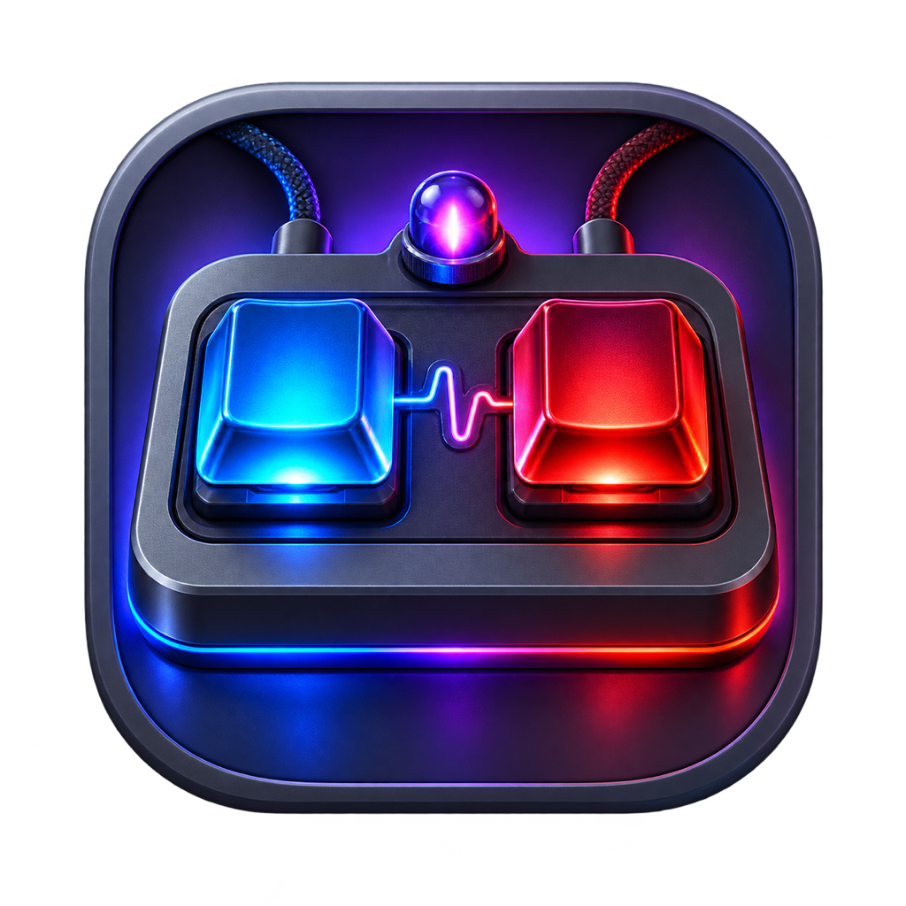

# Keyboard Studio

## Turn a tiny macro pad into a command center.

[](https://github.com/aranlucas/keyboard-studio/actions/workflows/ci.yml)
[](LICENSE)

Keyboard Studio is a native macOS SwiftUI configurator and Codex status deck for the SayoDevice O2L V2. Plug in the pad, stage a layer of shortcuts and macros, add a Codex Deck, and save only when the configuration looks right. The app reads the device over macOS IOKit HID and keeps edits reviewable before writing them.

<p></p>

The app is intentionally hardware-specific. The current HID bridge matches the SayoDevice O2L V2 vendor interface; it is not a general-purpose keyboard remapper.

## What it provides

It is the kind of tool you open before a focused coding session: one layer for navigation, another for text or password macros, and a status surface that tells you when Codex needs attention without stealing the keyboard focus.

- Read and edit button layers, key modes, modifiers, media actions, text/password macros, and lighting.
- Back up and restore device configuration, with protocol checks before a flash commit.
- Configure Hyperdeck gesture profiles and hot keys.
- Install a Codex Deck on Layer 1, map F13/F16 triggers, and show Codex work or attention status through the pad and menu bar.
- Review recent Codex activity and open Codex from the app or the menu bar.
- Run `sayo-probe` for device inspection and `protocol-check` for read-only protocol, backup, lighting, Codex Deck, and gesture assertions.

Device scripts are stored on the keyboard. Keyboard Studio does not execute shell scripts from the device. Input Monitoring is used only to connect to and configure the SayoDevice; the app registers dedicated F13/F16 hot keys rather than inspecting arbitrary keystrokes.

## Requirements

- macOS 14 or later.
- Swift 6 (the package declares `swift-tools-version: 6.0`).
- A connected SayoDevice O2L V2 for device features. The command-line protocol checks that do not require a device can still validate the model and configuration logic.
- macOS Input Monitoring permission when the HID bridge asks for it.

There is no checked-in Xcode project. The Swift Package Manager manifest is the build entry point; opening the package in Xcode is optional.

## Build and run

```bash
swift build
swift test
swift run KeyboardStudio
```

The read-only tools are separate products:

```bash
swift run sayo-probe
swift run protocol-check
```

To make a local, ad-hoc-signed `.app` bundle on a supported Mac:

```bash
scripts/package_app.sh
```

The script writes `dist/Keyboard Studio.app`, builds the host architecture, and signs it ad hoc. It is a local development package, not a notarized public distribution.

## Source map

| Path | Responsibility |
| --- | --- |
| `Sources/CHIDBridge/` | Small C bridge around IOKit HID discovery, access, reports, and callbacks. |
| `Sources/KeyboardCore/` | Sayo protocol models, device service, Codex activity, and shared configuration logic. |
| `Sources/KeyboardStudio/` | SwiftUI app, menu-bar deck, settings, device editor, lighting, backup, Hyperdeck, and Codex views. |
| `Sources/SayoProbe/` | Device and Codex Deck probe executable. |
| `Sources/ProtocolCheck/` | Offline protocol and configuration assertions. |
| `Tests/KeyboardCoreTests/` | Unit tests for the shared device and protocol layer. |
| `work/keyboard-two/` | Preserved reverse-engineering notes and evidence for the hardware protocol. |

## Validation

The repository CI runs formatting/package checks, `swift test`, a release build, `protocol-check`, and a Clang static analysis pass over the HID bridge. A physical keyboard is required to exercise live HID discovery and flash writes.

## License

See [`LICENSE`](LICENSE) and [`NOTICE`](NOTICE).
